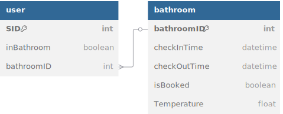

# Dormitory Shower Reservation System

This project was developed as a final project during our freshman year at Yuan Ze University. It addresses the inconvenience students face due to crowded showers and unpredictable hot water availability. The system was successfully implemented and tested in real university dormitory conditions, providing practical benefits for students.

## Project Overview

This reservation system allows students to reserve shower slots remotely, view real-time bathroom availability, and check estimated water temperatures, significantly reducing waiting times and enhancing convenience in daily dormitory life.

## ER Model

The Entity-Relationship (ER) Model is structured as follows:

- **User**:
  - `SID`: Student ID
  - `bathroomID`: Assigned bathroom ID
  - `inBathroom`: Indicates whether the user is currently in the bathroom

- **Bathroom**:
  - `bathroomID`: Unique ID for each bathroom
  - `checkInTime`: Timestamp when the bathroom is occupied
  - `checkOutTime`: Timestamp when the bathroom is released
  - `isBooked`: Indicates reservation status
  - `Temperature`: Current water temperature

**Relationship**:
- `booking`: Each user can book exactly one bathroom at a time, and each bathroom can be booked by exactly one user at a time.

## System Logic Flow

The system's operation logic is as follows:

1. **Main Page Check**:
   - Checks if the user already has a reservation.
     - If `true`: Allows cancellation of existing reservation.
     - If `false`: Directs the user to reservation interface.

2. **Reservation Interface**:
   - Users select desired bathroom from available options.

3. **Bathroom Availability ("light" indicator)**:
   - If the bathroom is occupied or reserved (`false`): Notifies the user of the reservation.
   - If the bathroom is available (`true`): Shows the current status (water temperature and usage duration).

4. **Reservation Confirmation**:
   - Checks if the bathroom is available for reservation.
     - If `true`: Reservation is successful.
     - If `false`: Alerts the user that the bathroom is already reserved.

## Technologies Used

- **Frontend**: HTML5, CSS3, JavaScript
- **Backend**: PHP
- **Database**: MySQL
- **Real-Time Data Handling**: AJAX

## Limitations

- Specifically tailored to Yuan Ze University's male dormitory.
- Assumes a standardized shower time of 15 minutes per user.
- Water temperature estimations do not consider environmental variables.

**Advisor:** Prof. Ting-Ying Chien

## Demonstration
[Dormitory Shower Reservation System Demo](https://youtu.be/_1cHWwucBow)

